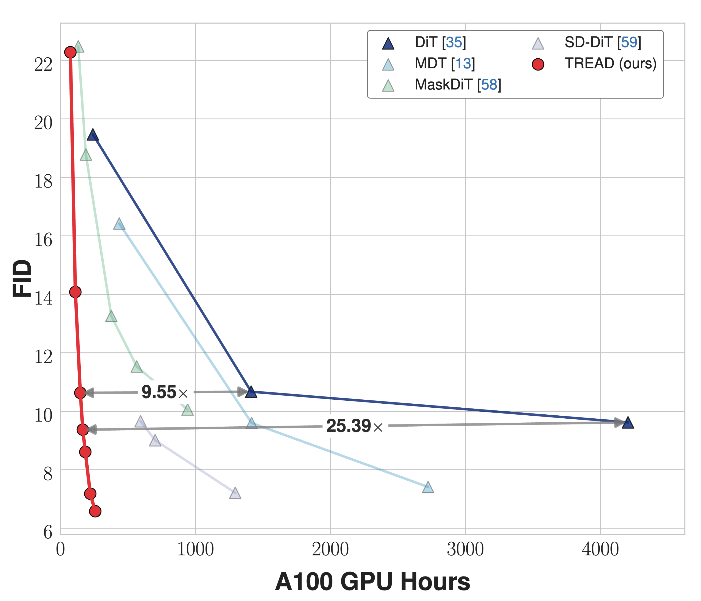

<h2 align="center">TREAD: Token Routing for Efficient Architecture-agnostic Diffusion Training</h2>
<div align="center"> 
  <a href="" target="_blank">Felix Krause</a> · 
  <a href="" target="_blank">Timy Phan</a> · 
  <a href="https://taohu.me" target="_blank">Vincent Tao Hu</a> · 
  <a href="https://ommer-lab.com/people/ommer/" target="_blank">Björn Ommer</a>
</div>
<p align="center"> 
  <b>CompVis Group @ LMU Munich</b> <br/>
</p>

[](https://arxiv.org/pdf/2501.04765)

This repository contains the official implementation of the paper "TREAD: Token Routing for Efficient Architecture-agnostic Diffusion Training".

We propose TREAD, a new method to increase the efficiency of diffusion training by increasing both iteration speed and performance at the same time. For this, we use uni-directional token transportation to module the information flow in the network.

<div align="center">
  
</div>

## 🚀 Usage

### Training

In order to train a diffusion model, we offer a minimalistic training script in `train.py`. In its simplest form, it can be started using:

```python
accelerate launch train.py
```

with `configs/config.yaml` having all the relevant information and settings for the actual training run. Please adjust this as needed before training.
`Note:` We expect precomputed latents in this version.
Under `model` one can decide between `dit and `tread` which are the preconfigured versions here with the former being the standard dit and the latter being supported by TREAD. How these changes are implemented can be seen in `dit.py` and `routing_module.py`.

In our paper, we show that TREAD can also work on other architectures. In practice, one needs to be more careful with the routing process in order to adhere to the characteristics of the architecture as some have a spatial bias (RWKV, Mamba, etc.) which needs to be respected. For simplicity, we only provide code for the Transformer architecture as it is the most widely used while being robust and easy to work with.

### Sampling

For sampling, we use the [EDM](https://github.com/NVlabs/edm) sampling, and the FID calculation is done via the [ADM](https://github.com/openai/guided-diffusion) evaluation suite. We provide a `fid.py` to evaluate our models during training using the same reference batches as ADM.

## 🎓 Citation

If you use this codebase or otherwise found our work valuable, please cite our paper:

```bibtex
@misc{krause2025treadtokenroutingefficient,
      title={TREAD: Token Routing for Efficient Architecture-agnostic Diffusion Training}, 
      author={Felix Krause and Timy Phan and Vincent Tao Hu and Björn Ommer},
      year={2025},
      eprint={2501.04765},
      archivePrefix={arXiv},
      primaryClass={cs.CV},
      url={https://arxiv.org/abs/2501.04765}, 
}
```

## Acknowledgements

Thanks to the open source codebases such as [DiT](https://github.com/facebookresearch/DiT), [MaskDiT](https://github.com/Anima-Lab/MaskDiT), [ADM](https://github.com/openai/guided-diffusion), and [EDM](https://github.com/NVlabs/edm). Our codebase is built on them.
